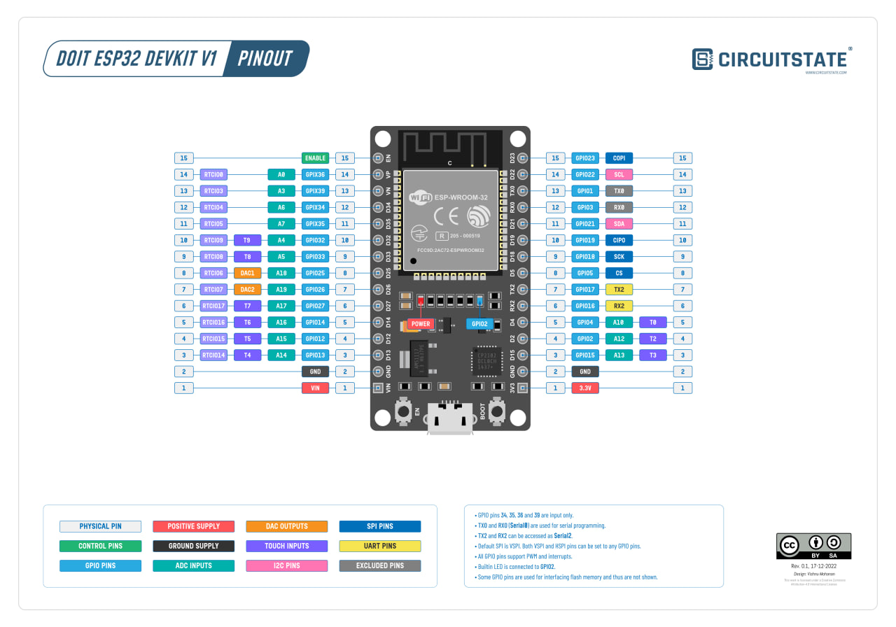

# LampControl ESP32 Firmware

## About

This repository contains the firmware for ESP32 that allows it to communicate with the LampControl Android application. It enables the ESP32 to act as a bridge between the app and your lighting system.

For additional features and a user-friendly interface, use the LampControl Android App. The app provides an intuitive way to control your LED lamp and can be found in the following repository:
[LampControl Android App](https://github.com/TraineeBeba/LampControl-Android-App)

## Installation

To install the firmware on your ESP32:

1. Clone the repository using:
git clone https://github.com/TraineeBeba/LampControl-ESP-32.git
2. Open the project in your Platform IO IDE.
3. Connect the ESP32 to your computer.
4. Compile and upload the firmware to the ESP32.

## Wiring

#### Button pin: 
D2 (GPIO2)
#### LED pin: 
D4 (GPIO4)

## Usage

Once the firmware is installed and the ESP32 device is turnes on - the Android app will discover ESP32 device, allowing you to control the lighting system through the app.

## Controlling Functionality

### By Button:
- **One Tap**: Change brightness (4 cyclic levels)
- **Double Tap**: Change mode (3 cyclic modes)
- **3 Sec Hold**: Turn the LED lamp on/off
